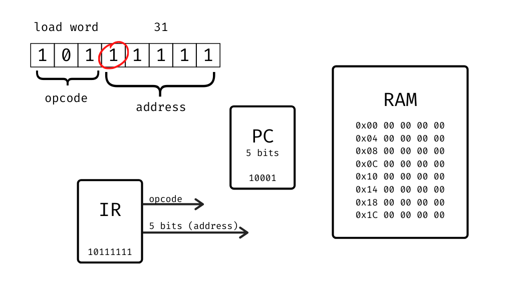

# Arquitectura TOY-8

Nombre y apellido:

## Instrucciones

- Forkear este repo
- Completar nombre y apellido
- Responder editando este mismo archivo
- Pushear a GitHub y pasarme el link de su fork (el repo tiene que ser público)


Tienen un emulador de la computadora y el circuito para el Logisim en el [blog](https://la35.net/orga/emulador.html). Usenlos sabiamente para responder.

**Tip:** si editan en el Atom tienen un _preview_ de Markdown tocando `Ctrl + Shift + M` mientras editan este archivo.
## Ejercicios

1. Considerar el siguiente programa de TOY-8 en lenguaje máquina. Traducir a hexadecimal en la tercer columna y a ensamblador en la cuarta como se muestra en la primera línea. ¿Cuál es el valor de 0xE cuando el programa se detiene? ¿Qué es lo que hace este programa si 0xE es el resultado del mismo?

```
0x1:  10101011    #  AB  #  lw  B
0x2:  11101010    #  EA  #  bze A
0x3:  00101101    #  2D  #  add D
0x4:  11001011    #  CB  #  sw  B
0x5:  10101110    #  AE  #  lw  E
0x6:  00101100    #  2C  #  add C
0x7:  11001110    #  CE  #  sw  E
0x8:  10100000    #  A0  #  lw  0
0x9:  11100001    #  E1  #  bze 1
0xA:  00000000    #  00  #  halt
0xB:  00000011    #  03  #  x = 3     (data)
0xC:  00000110    #  06  #  y = 6     (data)
0xD:  11111111    #  ff  #  -1        (data)
0xE:  00000000    #  00  #  prod = 0  (data)
```

Cuando el programa se detiene 0xE vale 18 o 0x12.
Este programa multiplica los números que se encuentran en 0xB y 0xC y pone el producto en 0xE.

2. Consideren el siguiente _hexdump_ de la memoria de TOY-8. O sea un volcado de la memoria en hexadecimal. ¿Cuántos programas distintos pueden encontrar? Indicar cuáles bytes interpretan como instrucciones y cuáles como datos.

```
0x0   00 A5 26 C7
0x4   00 08 05 00
0x8   A7 6D 2E C7
0xc   00 FF 01 00
```

Hay dos:

```
A5  # lw    5
26  # add   6
C7  # sw    7
00  # halt
```

Son las instrucciones, las posiciones 0x5, 0x6 y 0x7 son datos.

Y también tenemos,

```
A7  # lw    7
6D  # xor   D
2E  # add   E
C7  # sw    7  
00  # halt
```

Con 0x7, 0xD y 0xE como datos.

3. Para el primer programa del ejercicio anterior. ¿Qué líneas de control se activan para cada instrucción? ¿Cuál es el valor del bus de datos y de instrucciones en cada instrucción? Completen la siguiente tabla, agreguen las filas que sean necesarias.

|Instrucción|Reloj|Control|Data bus|Address Bus|
|---|---|-------------------------|---|---|
|A5 |0  |IR en                    |A5 |1  |
|A5 |1  |R en, addr mux           |08 |5  |
|26 |0  |IR en                    |26 |2  |
|26 |1  |R en, addr mux, ALUOp(00)|05 |6  |
|C7 |0  |IR en                    |C7 |3  |
|C7 |1  |RAM str, addr mux        |0D |7  |
|00 |0  |IR en                    |00 |4  |
|00 |1  |halt, addr mux           |00 |0  |

4. El siguiente programa suma los números que encuentra en la entrada hasta que aparece un cero, y luego envía el resultado a la salida. Traducirlo a ensamblador y a C siguiendo el ejemplo de las primeras dos líneas.

```
0x1:  A0   #  lw   0  #
0x2:  CE   #  sw   E  #  int sum = 0;
0x3:  AF   #  lw   F  #  scanf("%d", &num);
0x4:  E9   #  bze  9  #  while (num != 0) {
0x5:  2E   #  add  E  #    sum += num;
0x6:  CE   #  sw   E  #    
0x7:  A0   #  lw   0  #    scanf("%d", &num);
0x8:  E3   #  bze  3  #  }
0x9:  AE   #  lw   E  #  
0xA:  CF   #  sw   F  #  printf("%d", sum);
0xB:  00   #  halt    #
```

5. Una mejora que le podríamos hacer a esta computadora es duplicar la cantidad de memoria, pasar de 16 bytes a 32 bytes. ¿Cómo lo harían manteniendo la longitud de las instrucciones en 8 bits? ¿Qué partes de la CPU habría que modificar y cómo?

La manera más simple sería usar el bit número 4 (contando desde la derecha) de las instrucciones ya que en realidad no se usaba. Los bits 5 a 7 siguen codificando las instrucciones con _opcodes_ de 3 bits. Los 5 bits que quedan nos dan direcciones de memoria de 0x00 a 0x1F (del 0 al 31).

Por supuesto tenemos que cambiar la RAM por una de 32 bytes, el ancho del bus de direcciones pasa a 5 bits así que también reemplazamos el _program counter_. Los cables que salían de IR hacia el multiplexor del registro R, el PC y el multiplexor de direcciones pasarían a ser de 5 bits. Lo demás queda como está.

Hay que destacar que la unidad de control no requiere cambio alguno.


